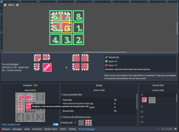
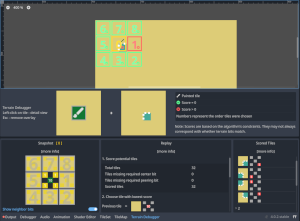
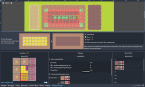

# Terrain Debugger
The Terrain Debugger plugin generates a real-time preview of the terrain tile selection algorithm in Godot 4.0.

There's been a lot of confusion about how Godot 4's terrain system works. And every time I thought I understood it, I quickly discovered I was wrong.

So I created this plugin by going into the core engine's `tile_map.cpp` and:
- tagging the constraints with information about where they came from
- collecting data detailing every step in selecting a tile
- sending that data to GDScript via signals
- processing the data into visual results

I did this to troubleshoot my own terrain tiles. But I thought that others might find it useful, so I added a proper UI and help text and created this repo.

It may help with:
- troubleshooting terrain tiles that aren't working as expected
- a visual aid for tutorials
- creating accurate documentation for Godot 4.0's terrain system
- assisting in specific, productive discussions in github proposals and issues
- testing changes to the core terrain tile algorithm, either for personal use or an engine contribution

### Examples
*Click to expand images*

The algorithm counting empty space as its own terrain. It allows correct matching for these tiles.

In this corners-mode set, the correct tile is missing, and the algorithm is valiantly trying to choose the least-offensive substitute.

An unexpected transition?

## Required downloads
1. **Custom editor build** - This addon requires an editor built from this [terrain-debugger branch](https://github.com/dandeliondino/godot/tree/terrain-debugger) (based on 4.0.2-stable).
    - Pre-compiled binaries are available as build artifacts for all major platforms except Linux (which seems to have failed due to a mono error)
        1. Go to [Actions](https://github.com/dandeliondino/godot/actions)
        2. Select the platform from the list on the left
        3. Select either workflow run
        4. Scroll down to artifacts
        5. Download the -editor file
    - To compile for your platform, clone the source branch locally and follow the ["Building from Source"](https://docs.godotengine.org/en/stable/contributing/development/compiling/index.html) directions in the Godot docs. Either a regular or debug build will work.
2. **Terrain Debugger plugin**
    - Download from [Releases](https://github.com/dandeliondino/terrain-debugger/releases)
    - or Clone the [terrain-debugger repository](https://github.com/dandeliondino/terrain-debugger)

## Installation
*The editor is branched off of 4.0.2-stable, rather than Master, so that it will be compatible with any Godot 4.0 projects. However, since it is a custom build, I recommend either making a copy of your project folder or creating a new project. I also don't recommend using this editor for anything other than debugging terrains -- the extra data collection will slow down the TileMap, and features or optimizations from the official builds may be missing.*

1. Move `addons/terrain_debugger` to your project folder.
2. Open your project using the custom editor.
    - *Using a regular editor to open a project with this plugin may cause a crash to desktop.*
3. Go to Project Settings -> Plugins and activate Terrain Debugger.

## Limitations
Terrain Debugger can be used with square tilesets in any mode, but it does not support:
    - alternative tiles
    - non-square tiles
    - multiple layers (tiles must be on layer 0)

## License
The Terrain Debugger plugin is covered by the MIT license in this repository.

The Godot engine, including the custom editor build linked above, is covered by the following license:
>Copyright (c) 2014-present Godot Engine contributors. Copyright (c) 2007-2014 Juan Linietsky, Ariel Manzur.
>
>Permission is hereby granted, free of charge, to any person obtaining a copy of this software and associated documentation files (the "Software"), to deal in the Software without restriction, including without limitation the rights to use, copy, modify, merge, publish, distribute, sublicense, and/or sell copies of the Software, and to permit persons to whom the Software is furnished to do so, subject to the following conditions:
>
>The above copyright notice and this permission notice shall be included in all copies or substantial portions of the Software.
>
>THE SOFTWARE IS PROVIDED "AS IS", WITHOUT WARRANTY OF ANY KIND, EXPRESS OR IMPLIED, INCLUDING BUT NOT LIMITED TO THE WARRANTIES OF MERCHANTABILITY, FITNESS FOR A PARTICULAR PURPOSE AND NONINFRINGEMENT. IN NO EVENT SHALL THE AUTHORS OR COPYRIGHT HOLDERS BE LIABLE FOR ANY CLAIM, DAMAGES OR OTHER LIABILITY, WHETHER IN AN ACTION OF CONTRACT, TORT OR OTHERWISE, ARISING FROM, OUT OF OR IN CONNECTION WITH THE SOFTWARE OR THE USE OR OTHER DEALINGS IN THE SOFTWARE.